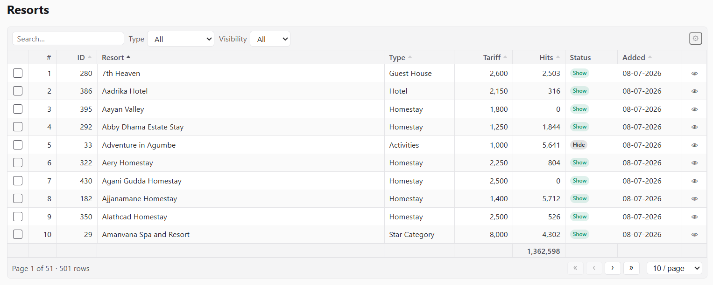
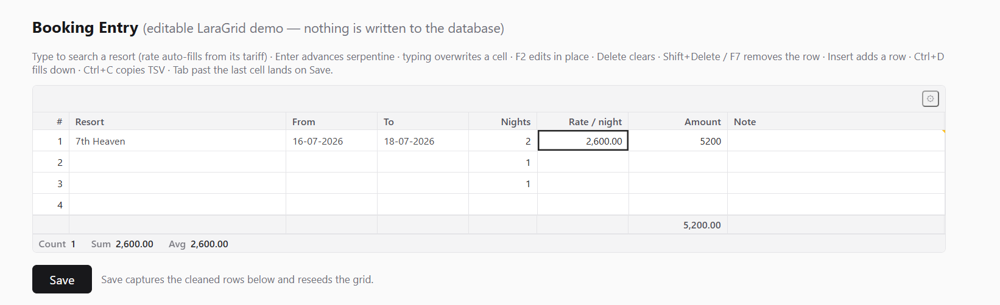

# LaraGrid

[](https://packagist.org/packages/unnathianalytics/laragrid/stats)
[](LICENSE)
[](composer.json)

Excel-style, keyboard-first datagrid for **Laravel + Livewire**. Extracted from a production
accounting system built for spreadsheet-trained operators, then made app-neutral.

The engine is framework-free vanilla JavaScript that owns every cell it paints: the grid body
lives inside a `wire:ignore` region, Livewire never morphs a row, and all server traffic runs
over renderless RPCs. The result is spreadsheet-grade speed with Laravel-grade authority —
every edit is validated, authorized, and recomputed server-side.

Everything is configured **in your component class with chained methods**. No blade wiring,
no JavaScript to write, no npm step — `composer require` is the entire install.

**Try it live → [grid.laravel.cloud](https://grid.laravel.cloud/)**

A readonly server-side grid — sorting, global search, filters, pagination, bulk selection and
footer totals, all through a whitelisted fail-closed pipeline:



An editable entry grid — typed cell editors, an async picker that enriches the row on select,
live formula columns, auto-append and a running footer:



## Contents

- [The three modes](#the-three-modes)
- [Requirements](#requirements)
- [Installation](#installation)
- [Quick start — a readonly list](#quick-start--a-readonly-list)
- [Quick start — an editable entry grid](#quick-start--an-editable-entry-grid)
- [Row lifecycle & blank rows](#row-lifecycle--blank-rows)
- [Ending entry — the completion flow](#ending-entry--the-completion-flow)
  - [`->endOfListOption()` — the picker exit](#-endoflistoption--the-picker-exit)
  - [`->completeWhenBalanced()` — the balancing guard](#-completewhenbalanceddr-cr--the-balancing-guard)
  - [What "complete" does](#what-complete-does)
  - [`->focusOutTo()` vs `->onCompleteFocus()`](#-focusoutto-vs--oncompletefocus)
- [Server hooks — enrichment & row consistency](#server-hooks--enrichment--row-consistency)
- [Display-only mode](#display-only-mode)
- [Column types](#column-types)
- [Grid definition reference](#grid-definition-reference)
- [Actions](#actions)
- [Toolbar, search & filters](#toolbar-search--filters)
- [Exports (CSV / XLSX / PDF)](#exports-csv--xlsx--pdf)
- [Saved views](#saved-views)
- [Keyboard](#keyboard)
- [Undo & redo](#undo--redo)
- [Theming](#theming)
  - [Shipped color schemes](#shipped-color-schemes)
  - [Custom tokens](#custom-tokens)
- [Extending](#extending)
- [Host events](#host-events)
- [Configuration](#configuration)
- [Troubleshooting](#troubleshooting)
- [Testing](#testing)
- [License](#license)

## The three modes

| Mode | Declare with | What you get |
|---|---|---|
| **Display** | rows passed to the tag | Paints in-memory rows. Works on plain Blade pages without any Livewire component. `->sortable()` columns sort **client-side** (stable, type-aware, empties last; click cycles asc → desc → original order) — built for computed report grids (trial balance, ageing) that can never be `query()`-backed. |
| **Readonly server-side** | `->query(fn () => Model::query())` | Sort, global search, filters, pagination through a whitelisted fail-closed pipeline. Page 1 ships in the initial payload (zero-round-trip first paint); later pages stream over an RPC with an LRU cache and idle prefetch of the next page. Opt-in CSV/XLSX/PDF downloads of the current view (`->exportable()`) and named per-user saved views (`->savedViews()`). |
| **Editable** | `->editable()->rowsFrom('lines')` | The full spreadsheet: optimistic client, authoritative server, typed op protocol, validation on both sides, formula columns, async pickers with row enrichment, auto-append, undo/redo, live footer totals. |

Both interactive modes share one keyboard model, one selection engine, one theming system.

## Requirements

- PHP ^8.1
- Laravel 10 / 11 / 12 / 13
- Livewire ^4.1 — installed automatically as a dependency

## Installation

```bash
composer require unnathianalytics/laragrid
```

That's all. The service provider auto-discovers, and the prebuilt script + stylesheet
auto-inject into any page that renders a grid. No layout directives, no build step.

Using [saved views](#saved-views) (`->savedViews()`)? Run the migrations once — the packaged
migration creates the `laragrid_views` table (name configurable via `laragrid.views.table`):

```bash
php artisan migrate
```

Grids that never declare `->savedViews()` don't need the table; skipping this step changes
nothing for them.

Optional publishes:

```bash
php artisan vendor:publish --tag=laragrid-config      # config/laragrid.php (global defaults)
php artisan vendor:publish --tag=laragrid-views       # blade views (mount + badge/edit-link cells)
php artisan vendor:publish --tag=laragrid-assets      # copy dist/ to public/vendor/laragrid
php artisan vendor:publish --tag=laragrid-migrations  # the saved-views table migration (auto-loads otherwise)
```

Asset delivery is configurable: set `laragrid.inject_assets => false` to place
`@laragridStyles` / `@laragridScripts` yourself, or point `laragrid.asset_url` at a CDN or the
published copy. Asset URLs carry a content hash, so upgrades bust browser caches automatically.

## Quick start — a readonly list

```php
use App\Models\Resort;
use LaraGrid\Actions\Action;
use LaraGrid\Aggregate;
use LaraGrid\Columns\{SerialColumn, TextColumn, IntegerColumn, DateColumn, ComputedColumn};
use LaraGrid\Filters\SelectFilter;
use LaraGrid\Grid;
use LaraGrid\Livewire\WithLaraGrid;
use LaraGrid\Support\CellHtml;
use Livewire\Component;

class ResortsIndex extends Component
{
    use WithLaraGrid;   // ← required: provides gridDefinition() and the grid RPCs

    protected function grids(): array
    {
        return ['resorts' => Grid::make('resorts')
            ->query(fn () => Resort::query())
            ->authorize('resort.viewAny')            // mandatory — grids are fail-closed
            ->paginate(25, [10, 25, 50, 100])
            ->defaultSort('name')
            ->searchable(['name', 'shortcode', 'resorts.slug'])   // see note below
            ->filters([
                SelectFilter::make('type')->label('Type')
                    ->options(fn () => Resort::distinct()->orderBy('type')->pluck('type', 'type')),
                SelectFilter::make('visibility')->label('Visibility')
                    ->options(['show' => 'Show', 'hide' => 'Hide']),
            ])
            ->columns([
                SerialColumn::make(),
                TextColumn::make('name')->label('Resort')->sortable()->searchable()->grow(),
                TextColumn::make('type')->sortable()->width(120),
                IntegerColumn::make('hits')->sortable()->width(90),
                ComputedColumn::make('status')->html()->width(90)
                    ->state(fn (array $row) => $row['visibility'] === 'show'
                        ? CellHtml::badge('green', 'Show')
                        : CellHtml::badge('zinc', 'Hide')),
                DateColumn::make('created_at')->label('Added')->sortable()->width(110),
            ])
            ->footer([Aggregate::sum('hits')->format('number')])
            ->exportable(['csv', 'xlsx', 'pdf'])     // toolbar Export control — see Exports
            ->actions([
                Action::make('edit')->icon('✎')->url(fn ($row) => route('resorts.edit', $row['id'])),
                Action::make('delete')->icon('✕')->confirm('Delete this resort?')
                    ->call(fn (array $row) => Resort::whereKey($row['id'])->delete()),
            ])
            ->stickyHeader()->striped()->maxHeight('70vh')];
    }

    public function render()
    {
        return view('livewire.resorts-index');
    }
}
```

```blade
<x-laragrid :grid="$this->gridDefinition('resorts')" />
```

**Search targets**: bare names in `->searchable()` must be declared columns — a typo fails
loudly at build time instead of silently searching nothing. To search a database column you
don't display, table-qualify it (`'resorts.slug'`); the dot marks it as an explicit DB column.

## Quick start — an editable entry grid

```php
use LaraGrid\Columns\{SerialColumn, SearchSelectColumn, IntegerColumn, DecimalColumn, FormulaColumn, TextColumn};
use LaraGrid\Editing\RowContext;

class BookingEntry extends Component
{
    use WithLaraGrid;

    /** @var list<array<string, mixed>> */
    public array $lines = [];

    public function mount(): void
    {
        $this->lines = $this->gridMountRows('lines');   // seeds defaultRows via the factory
    }

    protected function grids(): array
    {
        return ['lines' => Grid::make('lines')
            ->editable()
            ->rowsFrom('lines')                         // binds public array $lines
            ->authorize(fn () => $this->authorize('booking.create'))
            ->defaultRows(3)
            ->newRowUsing(fn () => ['nights' => 1])     // template for seeded AND inserted rows
            ->minRows(1)
            ->autoAppend()                              // Enter past the last cell grows the grid
            ->focusOnMount()
            ->focusOutTo('[data-save]')                 // Tab past the last cell lands on Save
            ->columns([
                SerialColumn::make(),
                SearchSelectColumn::make('resort_id')->label('Resort')
                    ->optionsUsing(fn (string $term) => Resort::query()
                        ->when($term !== '', fn ($q) => $q->where('name', 'like', "%{$term}%"))
                        ->limit(50)->get(['id', 'name'])
                        ->map(fn ($r) => ['value' => (string) $r->id, 'label' => $r->name])
                        ->all())
                    ->onSelect(function (RowContext $row, mixed $value): void {
                        // Enrichment: the pick pre-fills the rate; write-backs reconcile
                        // into the client row automatically.
                        $row->set('rate', Resort::whereKey($value)->value('comparison_tariff'));
                    })
                    ->required()->minChars(0)->debounce(250)->grow(),
                IntegerColumn::make('nights')->rules(['integer', 'min:1'])->required()->width(90),
                DecimalColumn::make('rate')->scale(2)->rules(['numeric', 'min:0'])->width(120),
                FormulaColumn::make('amount')->formula('round(nights * rate, 2)')->width(130),
                TextColumn::make('note')->maxLength(100)->grow(),
            ])
            ->footer([Aggregate::sum('amount')->format('number', ['scale' => 2])])];
    }

    public function save(): void
    {
        $rows = $this->gridRows('lines');       // cleaned: blank trailing rows + bookkeeping stripped

        Booking::createFromLines($rows);        // your persistence — the grid never owns it

        $this->lines = $this->gridMountRows('lines');
        $this->reseedGrid('lines');             // required after any out-of-band rows change
    }
}
```

The editable contract in one paragraph: the client applies every keystroke optimistically and
streams typed ops to the server, where each write is authorized, cast, validated, run through
your hooks, and formula columns are recomputed — the response reconciles authoritative values
back into the grid. Rows are addressed by stable keys, never positions. Blank trailing rows
(the auto-append artifact) are invisible to validation, totals, and `gridRows()`.

## Row lifecycle & blank rows

Understanding what counts as a **blank row** explains most editable-grid behavior, so here is
the full contract.

**Where rows come from.** An editable grid binds a `public array` on your component
(`->rowsFrom('lines')`); every row carries a stable client key `_k`. You get initial rows from
`$this->gridMountRows('lines')`, which builds `->defaultRows(n)` rows through the
**new-row template**: every declared column set to `null`, overlaid with your
`->newRowUsing(fn () => [...])` defaults. The *same* template builds rows grown at runtime —
Enter-past-the-last-cell (auto-append), the Insert key, and paste-created rows — so a seeded
row and a grown row are indistinguishable, server- and client-side.

**What "blank" means.** A row is blank when every *editable* cell still equals the new-row
template — factory defaults are not operator data. A booking grid seeded with
`['nights' => 1]` therefore still treats an untouched row as blank; the moment the operator
types anything real, it isn't. Non-editable carried values (ids, formula results, computed
cells) never make a row non-blank.

**What blankness controls.** Blank *trailing* rows (the auto-append artifact at the bottom)
are exempt from validation (a `required()` column never flags a row nobody touched), excluded
from footer totals, stripped by `gridRows()` at save, not counted by `->minRows(n)`, and are
where the end-of-list exit appears (next section).

**Row keys are law.** Every op addresses rows by `_k`, never by position — so sorting,
insertion and concurrent edits can never target the wrong row. If your host code ever replaces
the bound rows outside the op protocol (a save reset, importing lines), call
`$this->reseedGrid('lines')` so the client adopts the new set wholesale; skipping it leaves
the client referencing keys the server no longer has.

## Ending entry — the completion flow

Fast keyboard entry needs a deliberate *end*: with `->autoAppend()`, Enter past the last cell
keeps growing the grid forever. LaraGrid ships two "the operator is done" signals, both
funnelled through one channel so your page reacts identically regardless of how entry ended.

### `->endOfListOption()` — the picker exit

```php
SearchSelectColumn::make('item_id')
    ->endOfListOption()                                  // default label: <-- End of List -->
    // ->endOfListOption('— Done adding lines —')        // custom label
    // ->endOfListOption(allowOnEmpty: true)             // offer it even on an empty grid
```

Declared on a **picker column** (`SelectColumn` / `SearchSelectColumn` — the build fails loud
anywhere else), it injects a synthetic first entry into that column's dropdown, but only where
ending makes sense: on a **blank trailing row**, and only once the grid holds at least one real
row (pass `allowOnEmpty: true` for grids whose entries are optional — a charges grid a document
may legitimately have zero of). Choosing it commits **no value**; it fires the completion
signal. This mirrors classic data-entry systems where the operator ends line entry inside the
same dropdown they've been picking from, instead of tabbing out cell by cell.

### `->completeWhenBalanced('dr', 'cr')` — the balancing guard

For double-entry grids: while Σdr ≠ Σcr the grid keeps auto-appending; the moment the two
columns balance (both above zero), Enter past the last cell fires the completion signal instead
of growing the grid. With autofill (on by default), landing on an empty amount cell of the
deficit side pre-fills the balancing amount through the normal commit pipeline — the operator
accepts with Enter or overtypes.

### What "complete" does

Completion dispatches a bubbling `lgrid:complete` DOM event from the grid root
(`detail: { grid }`). Declare `->onCompleteFocus('[data-save]')` and the grid also moves focus
to that selector — with a built-in retry loop, so a Save button that only enables once the grid
is valid still receives focus. The result is the full keyboard circuit: *enter lines → end
entry (exit option or balance) → focus lands on Save → Enter posts.* For anything fancier,
listen for the event yourself:

```js
document.addEventListener('lgrid:complete', (e) => {
    if (e.detail.grid === 'lines') { /* open a confirm dialog, scroll a summary… */ }
});
```

### `->focusOutTo()` vs `->onCompleteFocus()`

Both take a selector and send focus there, and both resolve it through the same retrying
lookup — so a Save button that is disabled until the very commit that triggered the focus still
receives it (retried every 50ms for ~2s, and a `disabled` target is treated as not there yet).
That shared tail is where the similarity ends. They answer two different questions:

| | `->focusOutTo(selector)` | `->onCompleteFocus(selector)` |
|---|---|---|
| **Question it answers** | "Where does Tab go when it leaves the grid?" | "Where does focus go when entry is *finished*?" |
| **Trigger** | Forward Tab pressed on the **last navigable cell** | The **completion signal** — an `->endOfListOption()` pick, or Enter past the last cell once `->completeWhenBalanced()` balances |
| **Meaning** | Positional — the cursor ran out of grid | Semantic — the operator declared they're done |
| **Fires `lgrid:complete`?** | **No.** It's a navigation intercept, nothing else | **Yes.** The event dispatches first; the focus move is the packaged reaction to it |
| **Applies to** | Any grid, editable or readonly | Editable grids that declare a completion source |
| **While a cell editor is open** | Ignored — the editor owns Tab | N/A — completion only fires from a committed flow |
| **Rows left behind** | Grid keeps whatever rows it has; nothing is signalled | Same — completion commits no value; it only announces |

The practical difference: `focusOutTo` is a *tab-order repair*. Without it, Tab off the last
cell falls to whatever the browser thinks is next in the DOM — often nothing useful, since the
grid body is a `wire:ignore` island. It fires every time the operator tabs off the end, even on
row one of an empty grid, and it says nothing about whether the work is done.
`onCompleteFocus` is the *end of the entry circuit*: it only fires when the grid's own
completion guard says the operator finished, and it always comes with the `lgrid:complete`
event, so host code can react beyond focus.

Declaring both is the normal setup, and they don't conflict — they cover different exits from
the same grid:

```php
Grid::make('lines')
    ->editable()->rowsFrom('lines')->autoAppend()
    ->focusOutTo('[data-save]')        // operator tabs off the end → Save
    ->onCompleteFocus('[data-save]')   // operator picks "End of List" → lgrid:complete + Save
```

Point them at different targets when the two exits mean different things — Tab moves on to the
next form field, while completion jumps to Save:

```php
    ->focusOutTo('#remarks')
    ->onCompleteFocus('[data-save]')
```

If you only want the DOM event and will move focus yourself, declare `->onCompleteFocus()` not
at all and listen for `lgrid:complete` — the event fires with or without it.

## Server hooks — enrichment & row consistency

Three server-side hooks let a grid keep its rows internally consistent without any client code.
All of them receive a `RowContext` — `get('col')`, `set('col', $value)`,
`setLabel('col', $text)` for picker display labels — and every `set()` rides the op response
back into the client row. Crucially, **formula columns recompute after the hooks** in the same
operation, so a hook that sets `nights` also refreshes `amount = nights × rate` in one round
trip.

```php
// 1. Per-pick enrichment (SearchSelectColumn): the pick pre-fills dependent cells.
SearchSelectColumn::make('item_id')
    ->onSelect(function (RowContext $row, mixed $value): void {
        $item = Item::find($value);
        $row->set('rate', $item?->rate);
        $row->set('uom', $item?->uom);
    })

// 2. Grid-wide row consistency: runs after EVERY applied cell change (typing, paste,
//    fill-down). Example — derive nights from a date range:
->afterCellChange(function (RowContext $row, string $column): void {
    if (! in_array($column, ['fromDate', 'toDate'], true)) {
        return;
    }
    if ($row->get('fromDate') && $row->get('toDate')) {
        $nights = Carbon::parse($row->get('fromDate'))
            ->diffInDays(Carbon::parse($row->get('toDate')), false);
        $row->set('nights', $nights >= 1 ? (int) $nights : null);
    }
})

// 3. After a row removal — recompute host-side chrome (an "Allocated" total, a balance badge):
->afterRowRemove(fn () => $this->recomputeTotals())
```

The hooks are the *authoritative* half of the optimistic model: the client already painted the
keystroke; the server decides the truth and patches back anything the hooks changed.

## Display-only mode

```blade
<x-laragrid :grid="$grid" :rows="[['name' => 'Alpha'], ['name' => 'Beta']]" />
```

No `->query()`, no `->editable()` — the rows are painted as-is with full keyboard navigation,
selection, copy, column chooser, and footer totals. No Livewire component is required.
To refresh a display grid's data later, call `$this->reseedGrid('name', $freshRows)`.

## Column types

| Column | Editor | Value | Notes |
|---|---|---|---|
| `SerialColumn` | — | row number | the `#` gutter |
| `TextColumn` | text | string | `->maxLength()`, `->upper()`/`->lower()` |
| `IntegerColumn` | number | int | grouping-tolerant input |
| `DecimalColumn` | number | fixed-scale string | `->scale(n)`; precision never rides a float |
| `DateColumn` | date | ISO `Y-m-d` | fuzzy typed input (`31/12`, `311226`); display pattern configurable; financial-year inference opt-in |
| `SelectColumn` | dropdown | option id | `->options([...])` embedded whitelist |
| `SearchSelectColumn` | async picker | option id | `->optionsUsing(fn ($term, $row))`, `->onSelect()` enrichment, `->minChars()`, `->debounce()`, `->limit()` |
| `CheckboxColumn` | instant toggle | bool | Space/double-click toggle in place; Enter just advances |
| `YesNoColumn` | typed Y/N | bool | painted `Y`/`N` (blank until answered); typing `Y`/`N` commits and advances like Enter — the Tally Yes/No flow; Space still toggles in place |
| `FormulaColumn` | — | computed | `->formula('qty * rate')` — evaluated live client-side, authoritatively server-side |
| `ComputedColumn` | — | server-baked | `->state(fn ($row))`, pair with `->html()` for badges/links via `CellHtml` |
| `ReadonlyColumn` / `HiddenColumn` | — | display / carried | writes rejected server-side |

Shared column chains: `label`, `width` / `minWidth` / `maxWidth` / `grow`, `align`, `visible`,
`frozen`, `sortable(bool|'db.column')`, `searchable`, `filterable(Filter)`, `required` /
`required(fn)`, `readonly` / `readonly(fn)`, `rules([...])`, `lockedWhen('col', value)`,
`requiredWhen('col', value)`, `whenFilled(sets: [...], clears: [...])`,
`endOfListOption()` (see *Ending entry*), `opensPanel('name')`, `html()`,
`exportable(false)` (keep a painted column out of downloads).

## Grid definition reference

**Data** — `query(fn)` · `authorize(ability|fn)` · `paginate(per, [options])` ·
`defaultSort(col, dir)` · `searchable([...])` · `filters([...])` · `rowKey('id')` ·
`exportable([formats], fileName:, limit:)` (see [Exports](#exports-csv--xlsx--pdf)) ·
`savedViews(key?)` (see [Saved views](#saved-views)) ·
`rowActivate(fn ($row) => ?url)` — Enter/double-click opens a row, permission-gated per row.

**Editable** — `editable()` · `rowsFrom('prop')` · `defaultRows(n)` · `newRowUsing(fn)` ·
`minRows(n)` · `autoAppend()` · `padRows(n)` · `sync(SyncPolicy::PerCell|PerRow|Deferred)` ·
`refreshesHost([...])` (re-render host chrome when listed columns change) ·
`completeWhenBalanced('dr', 'cr')` · `afterCellChange(fn)` · `afterRowRemove(fn)`.

**Behavior** — `keymap('entry'|'excel')` · `toolbar(...)` / `toolbar(false)` ·
`focusOnMount()` · `focusOutTo(selector)` (Tab off the last cell lands here) ·
`onCompleteFocus(selector)` (the completion signal lands here — see
[the comparison](#-focusoutto-vs--oncompletefocus)) · `emptyState(text)` · `statusBar(bool)` ·
`persistWidths()` (column layout survives reloads).

**Layout** — `stickyHeader()` · `freezeColumns(n)` · `striped()` ·
`density(GridDensity::Compact|Normal|Comfortable)` · `height('420px')` · `maxHeight('60vh')` ·
`fillParent()` · `themeClass('my-theme')` · `rowClass(fn)` · `cellClass(fn)`.

## Actions

```php
->actions([          // per-row buttons in a trailing column
    Action::make('edit')->icon('✎')->url(fn ($row) => route('items.edit', $row['id'])),
    Action::make('archive')->confirm('Archive?')->visible(fn ($row) => ! $row['archived'])
        ->call(fn (array $row) => Item::whereKey($row['id'])->archive()),
])
->bulkActions([      // run over checked rows; a selector gutter + toolbar bulk bar appear
    Action::make('delete')->confirm('Delete selected?')
        ->call(fn (array $keys) => Item::whereKey($keys)->delete()),
])
->toolbarActions([   // grid-scoped buttons in the toolbar
    Action::make('new')->label('New Item')->url(fn () => route('items.create')),
])
```

Actions are fail-closed end to end: the client only echoes an action *name* (plus row keys) —
the server re-authorizes the grid gate, the per-action `->authorize()`, re-resolves the row
from its authoritative source, and re-checks `->visible()` before the closure runs. A hidden
button is an unusable button. `url()` actions bake their per-row URL server-side; rows where
the resolver returns `null` get no button. After a `call()` action, readonly grids refetch
their current page and editable grids receive a reseed payload automatically. Throw a
`ValidationException` inside a callback to show the operator a refusal message.

## Toolbar, search & filters

The toolbar renders itself from the definition: a debounced search box (when the grid declares
`->searchable()`), one control per grid-level filter, the bulk bar, toolbar action buttons, the
Export control (when the grid declares `->exportable()`), and the column chooser. Suppress or
tune it: `->toolbar(false)`, `->toolbar(search: false)`. Filter options accept a
`{value => label}` map (the `pluck()` idiom), a list of `['value' => , 'label' => ]`
rows, or plain scalars. `SelectFilter` and `TernaryFilter` (All / Yes / No) ship in core; column
header funnels via `->filterable()` run through the same whitelisted pipeline.

## Exports (CSV / XLSX / PDF)

Readonly `->query()` grids can offer file downloads of the register — opt-in, per grid:

```php
Grid::make('resorts')
    ->query(fn () => Resort::query())
    ->authorize('resort.viewAny')
    ->exportable()                                    // csv + xlsx + pdf (the config default set)
    // ->exportable(['csv', 'xlsx'])                  // or exactly these formats
    // ->exportable(['csv'], fileName: 'resorts', limit: 10000)
```

An **⤓ Export** control appears in the toolbar (a single format downloads directly; several
open a menu). The download is always the operator's **current view**: the active sort, global
search and filters apply — the whole filtered set, never just the visible page — through the
same whitelisted, fail-closed pipeline as every fetch. The `gridExport` RPC re-runs the grid's
`->authorize()` gate and refuses any format the definition doesn't enable.

**What lands in the file** is what the grid paints: picker columns export their **labels** (not
ids), `YesNoColumn` exports `Y`/`N` (blank while unanswered), `CheckboxColumn` exports
`Yes`/`No`, dates use the configured display pattern, and `->html()` cells are stripped back to
plain text. Summable numeric columns stay **raw** in CSV/XLSX — real number cells a spreadsheet
can total — while the PDF (a visual document) formats them through each column's format tag.
Footer sums append as a totals row that always equals the rows actually in the file, and every
file is capped at `laragrid.export.max_rows` (default 50,000; override per grid with `limit:`).
Hidden columns never export; keep a painted column out of the file with `->exportable(false)`
on the column.

All three writers are **dependency-free** — CSV (BOM'd UTF-8), XLSX (native SpreadsheetML,
typed number cells, needs only `ext-zip`), and PDF (native A4 writer: auto-landscape, repeated
header row, page numbers; base-14 Helvetica, so Latin-1 text — characters outside it
transliterate). Need branded PDFs, full Unicode fonts, or another format? Register your own
writer under any name and grids enable it like a shipped one:

```php
// A service provider:
app(\LaraGrid\Export\ExporterRegistry::class)->register('pdf', new BrandedDompdfExporter);
app(\LaraGrid\Export\ExporterRegistry::class)->register('ods', new OdsExporter);

// A grid:
->exportable(['csv', 'ods'])     // unknown names still fail loudly at build time
```

Hosts rendering fully custom chrome (`->toolbar(false)`) trigger downloads over the same
event bridge as search/filters:

```js
el.dispatchEvent(new CustomEvent('lgrid:toolbar', {
    bubbles: true, detail: { grid: 'resorts', kind: 'export', value: 'xlsx' },
}));
```

## Saved views

Readonly `->query()` grids can offer **named, server-persisted view snapshots** — an operator
sets up "Pending GST invoices" once (search + filters + sort + per-page + column widths and
hidden columns) and recalls it from a toolbar **❖ Views** menu in any later session, on any
machine:

```php
Grid::make('resorts')
    ->query(fn () => Resort::query())
    ->authorize('resort.viewAny')
    ->savedViews()                    // opt-in; ->savedViews('key') overrides the storage key
```

Run `php artisan migrate` once — the packaged migration creates the `laragrid_views` table
(name configurable via `laragrid.views.table`). The Views menu then lists the operator's saved
views: picking one applies it (layout instantly, data through the same whitelisted pipeline as
any filter change), **＋ Save current view…** captures the current state under a name (saving
an existing name updates it), and ✕ deletes.

Views are **per-user and fail-closed**: the scope is minted server-side from the authenticated
user (guests are refused), every RPC re-runs the grid's `->authorize()` gate, and the saved
state is sanitized against the grid's *declared* columns, filters and page sizes — unknown keys
are dropped on write, and applying a view still runs through the same whitelisted `gridFetch`
pipeline as every fetch. One operator can never see, apply or delete another's views. Each
operator may keep up to `laragrid.views.max_per_grid` (default 50) views per grid.

Storage is swappable: rebind `LaraGrid\Views\ViewStore` in a service provider to keep views in
Redis, a tenant-scoped table, or an existing preferences service — the three-method interface
(`list` / `save` / `delete`) is the whole contract.

Note `->savedViews()` persists views **server-side by name, on demand**, while
`->persistWidths()` silently persists the current column layout in `localStorage` — the two
compose: recalling a view also updates the persisted layout.

## Keyboard

| Keys | Action |
|---|---|
| Arrows / Tab / Home / End / PageUp / PageDown / Ctrl+edges | navigate |
| Shift + movement, Ctrl+A | extend / select all |
| Ctrl+C | copy selection as TSV (pastes into Excel; paste back round-trips) |
| Type / F2 / double-click | overwrite / edit a cell |
| Space | toggle a `CheckboxColumn` / `YesNoColumn` cell in place |
| `Y` / `N` | answer a `YesNoColumn` cell **and advance** — one keystroke per row |
| Enter | commit + advance — serpentine in `entry`, down in `excel` |
| **Delete** | **clear** selected cells |
| **Shift+Delete or F7** | delete the row (minRows-guarded) |
| Insert / Ctrl+D | insert row / fill down |
| **Ctrl+Z** | **undo** the last change (editable grids) |
| **Ctrl+Y or Ctrl+Shift+Z** | **redo** |
| Ctrl+E | jump to the first error |
| ContextMenu / Shift+F10 | open the row's actions menu |
| Escape | clear selection / cancel edit |

Paste is bulk-aware: a multi-row TSV paste maps onto editable cells, auto-appends rows as
needed, and flushes as one batch (with a confirm above 500 cells).

## Undo & redo

Editable grids keep a full undo history (100 steps) — **Ctrl+Z** reverts the last change,
**Ctrl+Y** / **Ctrl+Shift+Z** re-applies it. One gesture is one step: a 200-cell paste, a
fill-down, a row delete, or a commit together with its declarative side effects (`whenFilled`
mirrors, formula recomputes, picker labels) each undo as a single unit. Undoing a row delete
restores the row **at its original position** with its data and labels intact.

Undo never bypasses the server: each undone step replays through the same op protocol as
typing — the server re-validates, re-runs your `onSelect`/`afterCellChange` hooks and
recomputes formulas authoritatively, so an undo can never resurrect a value your rules would
refuse. History is per-mount and clears on any wholesale reseed (`reseedGrid`, a structural
rollback, save exit paths).

One caveat: non-writable carried values (e.g. a `HiddenColumn` database id that is not
`->writable()`) are client-painted on restore but re-created server-side — a host whose save()
diffs lines by id sees a deleted-then-undone row as delete + insert.

## Theming

### Shipped color schemes

Six presets ship with the package, each with a coordinated **light and dark** variant:
`zinc` · `blue` · `emerald` · `amber` · `rose` · `violet`.

```php
Grid::make('items')->theme('blue')        // per grid (unknown names fail loud at build time)
```

```php
// config/laragrid.php — app-wide default; any grid's ->theme() overrides it
'theme' => 'emerald',
```

A scheme tints the accent (active-cell ring, selection, focus), header/footer surfaces,
stripes, and borders as one coordinated family; the dark variant applies automatically under
your `.dark` class. Internally each preset is just an accent pair — every surface derives from
it via a shared `color-mix` formula — so all schemes stay tonally consistent, and adding your
own is two custom properties on a class you pass to `->themeClass()`:

```css
.lgrid--theme-brand { --lgrid-theme-accent: #0f766e; --lgrid-theme-accent-dark: #2dd4bf; }
```

### Custom tokens

Every visual is a `--lgrid-*` CSS token (row height, paddings, all colors) with self-contained
defaults — the grid looks right on a page with no CSS framework at all. In a Tailwind v4 app it
adopts your `--color-*` `@theme` palette automatically. Override tokens globally, under your own
`->themeClass()`, or under `.dark` (dark mode is token-flipping, nothing more). All elements
carry stable `lgrid-*` semantic classes, so any part is restylable and nothing is ever purged
by a build tool. Print collapses to a clean black-on-white table.

## Extending

```php
// A custom column type is just a class:
class RatingColumn extends \LaraGrid\Columns\Column
{
    public function painterId(): string { return 'rating'; }
    public function editorId(): ?string { return 'rating'; }
    public function parseSpec(): array { return ['kind' => 'int']; }
}

// App-specific formatters and parse kinds register in a service provider:
app(\LaraGrid\Formatting\FormatRegistry::class)->register('inr', new InrFormatter);
app(\LaraGrid\Casting\CastRegistry::class)->register('paise', new PaiseCast);
```

```js
// The JS twins and custom UI register through window.LaraGrid — via the ORDER-INDEPENDENT
// `pending` queue, which works from any script position, before or after the grid bundle:
(window.LaraGrid = window.LaraGrid || {}).pending = [
    (LG) => {
        LG.registerPainter('rating', (cellEl, ctx) => { /* draw the cell */ });
        LG.registerEditor('rating', RatingEditor);        // { mount, value, focus, destroy }
        LG.registerFormatter('inr', (value, args) => …);  // twin of the PHP formatter
        LG.registerCast('paise', { parse, editText });    // twin of the PHP cast
    },
];
```

**Why the queue**: with auto-injection the grid bundle is appended at the end of `<head>` —
*after* your app bundle — and both are deferred, so yours executes first, when
`window.LaraGrid` doesn't exist yet. The queue closes that gap: seed callbacks from any
script, and the bundle applies them **before the first paint** (it drains the queue when it
loads, and defers its first scan to `DOMContentLoaded` so every deferred script has run by
then). After boot the queue stays live — `window.LaraGrid.pending.push(fn)` applies
immediately — so the idiom above is always correct, everywhere. Calling
`LaraGrid.registerFormatter(...)` directly is safe only from code that provably runs after
boot (a click handler, a dynamic import); anything that must affect the first paint goes
through the queue.

Custom painters and editors build their DOM with `LG.el(tag, className, text)` — the same
XSS-safe element factory the built-in renderers use.

Formatting and casting run in **both** runtimes — the client for instant paint, the server for
authority. Every PHP formatter/cast you register must have a behaviourally identical JS twin
under the same name, pinned by a shared vector in `tests/fixtures/grid-vectors/` (the package's
own suite runs 142 vectors through both runtimes on every build).

## Host events

Grid → host (bubbling DOM events): `lgrid:complete` (entry finished), `lgrid:activate`
(row opened), `lgrid:panel` (cell hands off to a host modal), `lgrid:column-resized`,
`lgrid:column-visibility`. Host → grid: `lgrid:reseed` (use `$this->reseedGrid(...)`),
`lgrid:panel-done` (use `$this->gridPanelDone(...)`), `lgrid:toolbar` (drive the grid from
fully custom host chrome).

## Configuration

`config/laragrid.php` holds app-wide *defaults* only — density, keymap preset, date display
pattern, financial-year start month (off by default), toolbar defaults, export defaults
(format set, row cap, streaming chunk size), saved-views defaults (table name, per-grid cap),
asset injection and asset URL. Any grid overrides any of them through its chained definition.

## Troubleshooting

- **"Method …::gridMountRows does not exist"** — add `use WithLaraGrid;` *inside* the component
  class (importing the trait at the top of the file is not enough).
- **"No hint path defined for [layouts]"** on a bare Livewire 4 app — pin the layout on your
  full-page component: `#[Layout('components.layouts.app')]`.
- **"searchable target [x] is not a declared column"** — declare the column, or table-qualify
  the target (`'items.slug'`) to search an undisplayed DB column.
- **Stale assets after upgrading** — none: tags carry a content hash. If a proxy interferes,
  hard-refresh once.

## Testing

Package suite: `composer test` (Pest via Testbench) and `npm test` (Node vector runners) —
PHP and JS are asserted against the same committed vectors. Your app tests drive grids through
the public RPCs, exactly as the browser does:

```php
Livewire::test(BookingEntry::class)
    ->call('gridOps', 'lines', ['ops' => [
        ['t' => 'set', 'seq' => 1, 'row' => $key, 'col' => 'nights', 'v' => '3'],
    ]])
    ->call('gridAction', 'resorts', 'delete', [$id]);
```

## License

MIT © Unnathi Analytics
